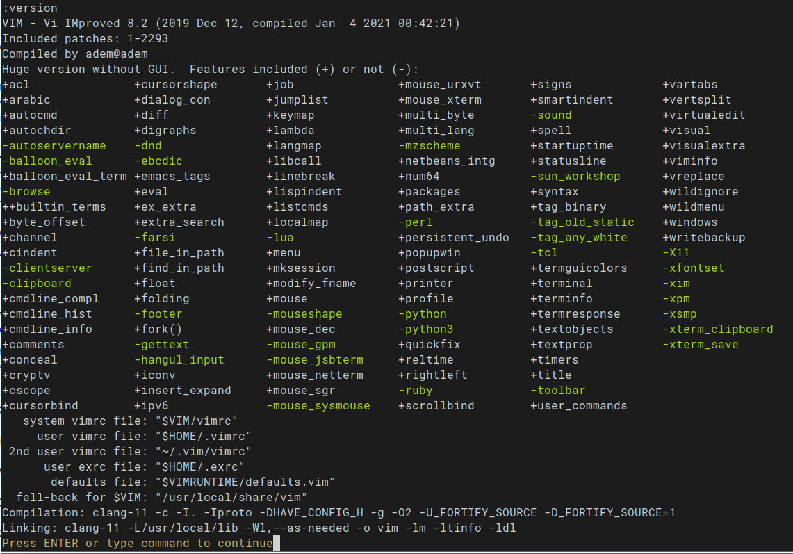

<p align="center"></p>

 <p align="center"> Yet another quick reference for Vim text editor </p>
		 
<div id="contents"></div>

- [Quit the Vim](#quit-the-vim)
- [What is Vim?](#what-is-vim)
  * [History of Vim](#history-of-vim)
  * [Forks and Vanillas](#forks-and-vanillas)
- [Creating a file](#creating-a-file)
- [Vim modes](#vim-modes)
- [General](#general)
- [Moving around](#moving-around)
- [Entering insert mode](#entering-insert-mode)
- [Working more than one file](#working-more-than-one-file)
  * [using tab pages](#using-tab-pages)
- [Repeating commands without repeating yourself](#repeating-commands-without-repeating-yourself)
  * [repating more than one command by recording](#repating-more-than-one-command-by-recording)
- [Editing](#editing)
  * [find and change](#find-and-change)
- [Some frequently used commands](#some-frequently-used-commands)
- [Configure](#configure)
  * [dotfiles and .vimrc](#dotfiles-and-vimrc)
    - [Managing dotfiles](#managing-dotfiles)
  * [mapping](#mapping)
    + [leader variable](#leader-variable)
  * [Adding plugin](#adding-plugin)
    + [adding plugin with vim-plug](#adding-plugin-with-vim-plug)
  * [Creating your own plugin](#creating-your-own-plugin)
    + [Hello World plugin](#hello-world-plugin)
  * [Vim for programmers](#vim-for-programmers)
  * [An incomplete list of plugins](#an-incomplete-list-of-plugins)
- [Links](#links)
  * [sites](#sites)
  * [books](#books)
  * [cheatsheets](#cheatsheets)
  * [video series](#video-series)
- [Building Vim from source code](#building-vim-from-source-code)


### [Quit the Vim](https://stackoverflow.blog/wp-content/uploads/2017/05/country_stuck_vim-1-2-1024x1024.png)

`<esc> :q! <enter>`  

### What is Vim?

Vim is a highly configurable text editor for fast and effective text editing.

Vim is not designed for hold users hand, it's a tool and must be learned how to use. Vim is not a word
processor.

#### History of Vim<sup>1</sup>

*ed* was the original Unix text editor. It was written at a time when video
displays were uncommon. Source code was usually printed onto a roll of paper
and edited on a teletype terminal.  Commands entered at the terminal would be
sent to a mainframe computer for processing, and the output from each command
would be printed. In those days, the connection between a terminal and
a mainframe was slow, so much so that a quick typist could outpace the network,
entering commands faster than they could be sent for processing. In this
context, it was vital that ed provide a terse syntax. Consider how p prints the
current line, while %p prints the entire file.  ed went through several
generations of improvements, including em (dubbed the *“editor for mortals”*),
en, and eventually *ex*.

 By this time, video displays were more common. ex added a feature that turned
the terminal screen into an interactive window that showed the contents of
a file. Now it was possible to see changes as they were made in real time. The
screen-editing mode was activated by entering the `:visual` command, or just
`:vi` for short. And that is where the name vi comes from.  Vim stands for vi
improved. That’s an understatement—I can’t stand to use regular vi! Look up `:h
vi-differences` for a list of Vim features that are unavailable in vi. Vim’s
enhancements are essential, but it still owes much to its heritage. The
constraints that guided the design of Vim’s ancestors have endowed us with
a highly efficient command set that’s still valuable today.

#### Forks and Vanillas

- [Neovim](https://neovim.io/)

> Neovim is a fork of the venerable text-editor vim, focused on extensibility
> and usability. It is not a rewrite but a continuation and extension of
> Vim. Many clones and derivatives exist, some very clever—but none are
> Vim. Neovim is built for users who want the good parts of Vim, and more. See
> a list of differences via :help vim-differences. 

- [SpaceVim](https://spacevim.org/) 

> SpaceVim is a community-driven modular Vim distribution. It manages
> collections of plugins in layers, which help to collect related packages
> together to provide IDE-like features.

- [Onivim 2](https://www.onivim.io/) 

> Onivim 2 is a reimagination of the Oni editor. Onivim 2 aims to bring the
> speed of Sublime, the language integration of VSCode, and the modal editing
> experience of Vim together, in a single package.

Also you might want to take a look at [this
talk](https://www.youtube.com/watch?v=Pi8qRg_gseQ) on
[VimConf.live](https://www.vimconf.live/)

### Creating a file 

```sh
$ vim <enter>
$ vim filename
$ vim directory/filename
```
<sub>[⇧ back to top](#contents)</sub>

### Vim modes

Vim provides different modes to users for focus on content.

* normal mode: vim starts with this mode. Esc is used for enter this mode. `:h
  Normal-mode`:tropical_fish:
* insert mode: used for add text to editor, can be entered by one of [insert
  commands](#entering-insert-mode) `:h Insert-mode`:tropical_fish:
* replace mode: used for replace existing text by directly typing over it, can
  be entered by `R` `:h  Replace-mode`:tropical_fish:
* visual mode: used for select an area on text. Character-wise selection can be
  made by v, line-wise selection can be made by V, and block-wise with C-v `:h
Visual-mode`:tropical_fish:
* command mode: used for enter Ex commands, can be entered by `:` and require
  to press enter key. Example: `:w <enter>` `:h Cmdline-mode`:tropical_fish:

<sub>[⇧ back to top](#contents)</sub>

### General

```
$ vimtutor          Official tutorial of Vim

:h user-manual
:h help-summary     On usage of build-in documantation
:h subject          help about the *subject*. Ex: `:h python` (C-] to click hyperlinks, C-T to back)

:q                  quit
:w                  write
:saveas filename    save as
:wa                 write all the changes
:wa[!]              force Vim write all the changes
:wq                 write and quit
:x                  update and quit
:wqa                write quit all
:q!                 if file is changed and not supposed to saved, quit
```
```
u                undo example: 4u
C-r              redo (push Ctrl button then r)
U                Undo all line

s=seconds, m=minute, h=hour, d=day
:earlier #m     turn back # minute ago of the file Ex: :earlier 2m or :ea 3d
:later #m       turn back # minute later state of the file Ex: :later 7s  or  :lat 9h
```

```
y                yank, copy 
yy               yank all line
p                paste to below of cursor
P                Paste to above of the cursor
c                change, change the selected area
.                repeat latest command
```

```
:term    start a terminal session inside vim, more at `:h terminal`
:!<cmd>   execute <cmd> commands without leaving Vim Ex: `!g++ -wall -std=c++14 main.cpp`, `!ruby %`
:sh      go to shell, return by `exit`
$C-z      send vim to background, return by $fg
```

<sub>[⇧ back to top](#contents)</sub>
### Moving around

`:h motion`:tropical_fish:  
```
                                k
h        cursor left            ^
j        cursor down       h <     > l
l        cursor right           v
k        cursor up              j
```

```
0        beginning of line
$        end of line
```

```
w        jump to first character of next word
e        jump to last character of the current word
b        jump to first character of the current word
```

```
H        jump to *top* of the screen
M        jump to *middle* of the screen
L        jump to *lower* of the screen
```

```
C-b      jump a full screen size up
C-f      jump a full screen size down
C-u      jump half screen size up
C-d      jump half screen size down
```

`:h scroll-cursor`:tropical_fish:  
<sub>[⇧ back to top](#contents)</sub>
```
z<enter> redraw, cursor on the top of window, and put cursor at first non-blank in the line
zt       like above but leave the cursor in the same column

z-       redraw, cursor on the bottom of window, and put cursor at first non-blank in the line
zb       like above but leave the cursor in the same column

z.       redraw, cursor on the center of window, and put cursor at first non-blank in the line
zz       like above but leave the cursor in the same column
```

```
w        jump beginning of next word (punctuation considered as a word)
e        jump end of the word
ge       jump end of the previous word
b        jump begining of the previous word
^        jump to first non space character on line
gg       top of the file
G        bottom of the file
+        begining of the next line
-        beginning of the previous line
```
``` 
W        jump beginning of the next word (punctuation not considered words)        v           v 
E        jump end of the next word (punctuation not considerd as words) Ex:  e (abcd)   E (abcd)
B        jump begining of the previous word
#G       go to line number #  Ex: 38G
#gg      same as #G
```

In more general<sup>2<sup>:
```
                gg
                 ?
                C-b
                 H
                 {
                 k
^ F T ( b ge h       l w e ) t f $
                 j
                 }
                 L
                C-f
                 /
                 G
```

<sub>[⇧ back to top](#contents)</sub>
### Entering insert mode

```
                           /~~~~~~~~~~~~\
                           |command mode|
                           \~~~~~~~~~~~~/
                           |           |
                           ^ :/        v Esc Esc
                           |           |
 /~~~~~~~~~~~~\----Esc---->/~~~~~~~~~~~\<---Esc------/~~~~~~~~~~~\
 |replace mode|            |normal mode|             |insert mode|
 \~~~~~~~~~~~~/<----R------\~~~~~~~~~~~/--aAiIoOsS-->\~~~~~~~~~~~/
                           |           |
                           v vV        ^ Esc
                           |           |
                           /~~~~~~~~~~~\
                           |visual mode|
                           \~~~~~~~~~~~/

```
``` 
i        insert text before cursor
I        insert text to start of the line
a        append after cursor
A        append text to end of line
o        make newline below to current line and insert text
O        make newline above to current line and insert text
s        delete character under cursor and enter insert mode
S        delete all line and enter insert mode
cc       same as above
cw       change from cursor position to start of the next word

S-r      enters [replace mode](#replace-mode), change text in place 
```
<sub>[⇧ back to top](#contents)</sub>

### Working more than one file

`:h usr_08.txt`:tropical_fish:  

```
C-ws       split current window horizontally (alternative :split)
C-wv       split current window vertically (alternative :vsplit)
C-ww       jump to next window
```

```
C-w h      jump from current window to window on the left
C-w j      jump from current window to window on below
C-w k      jump from current window to window on above
C-w l      jump from current window to window on the right
C-w t      jump to top most left window
C-w b      jump to bottom most right window
```
```
C-wq       close current window
:close     same as above
:only      close windows other than current
```
```
C-w#<      resize current window to the left # of times (default 1)
C-w#>      resize current window to the right # of times (default 1)
:res #     resize horizontally splitted window # of times
```
<sub>[⇧ back to top](#contents)</sub>

`:h window-moving`:tropical_fish:
```
C-wH       move current window to the far left
C-wJ       move current window to the very bottom
C-wK       move current window to the very top
C-wL       move current window to the far right
```

```
$vim --help               for list Vim paramaters `h vim-arguments`:tropical_fish:

$ vim -O2 f1.txt f2.txt   open Vim with `-O[N]` paramater, vertically splitted f1.txt and f.txt 
$ vim -o2 f1.txt f2.txt   like above but horizontally splitted
$ vim -P2 f1.txt f2.txt   like above but on tab pages

$ vim f1.txt f2.txt       open the files but show only one at a time (navigate with :next and :prev)
```
<sub>[⇧ back to top](#contents)</sub>
#### using tab pages

`:h tabpage`:tropical_fish:

```
:tabedit filename   edit specified file in a new tab
:tabfind filename   open a new tab with filename given, searching the 'path' to find it
```
```
:tabn       next tab
:tabp       previous tab
:tabfirst   first tab
:tablast    last tab
```
```
:tabm {i}    move current tab to i+1 place
```
```
:tabclose i   close tab i
:tabclose     close current tab
:tabonly      close other tabs but current
```
```
:tabs         list tabs
```
<sub>[⇧ back to top](#contents)</sub>

### Repeating commands without repeating yourself

**operator [number] move** or **[number] operator move**

```
c3w      or 3cw, cw cw cw
4j       jjjj 
2w       w w,  go to the begining of 2 next words
2dd      delete 2 lines
```

<sub>[⇧ back to top](#contents)</sub>
#### repating more than one command by recording

`:h recording`:tropical_fish:  

Recording more than 1 move would be greatly useful. Vim has 26 register(a-z),
which can be considered
26 different clipboard!!! 
1. start recording with `q` and choose a register to record on. Ex: qa
2. exit from recording with Esc.
3. apply what you record with `@<reg>` Ex: @a<enter>
        
```
q[a-z]   start recording
@[a-z]   apply record
```

<sub>[⇧ back to top](#contents)</sub>
### Editing

```
x        delete the character under the cursor
X        delete the character before the cursor
dw       delete word from cursor position to start of the next word(punctuation considered as a word)
dW       delete Word from cursor position to start of the next word 
d^       delete from first non-whitespace character to end of line (inclusively)
d$       delete till end of the line
D        same as above
dd       delete all line
dib      delete content inside the paranthesis
```

```
r<c>     change the character under the cursor to <c> 
```

```
*        find next word under cursor
f<c>     find character <c> from current cursor position inside the line
'.       jump to last edited line
g;       jump back to last editted position
```
```
:ab sth something         in insert mode, when written 'sth'<space> change it with 'something' 
```

```
:g/^#/d  delete all the lines start with #
:g/^$/d  delete all the empty lines
```

<sub>[⇧ back to top](#contents)</sub>
#### find and change

`:h substitute`:tropical_fish:  
```
:s/old/new      change first 'old' with 'new' on the current line
:s/old/new/g    change all 'old' with 'new' on the current line
:s/old/new/gc    change all 'old' with 'new' on the current line but before ask for permission

:#,#s/old/new/g   change all 'old' with 'new' between the lines # and #
:%s/old/new/g    change all 'old' with 'new' on the current file
:%s/old/new/gc    change all 'old' with 'new' on the current file but before ask for permission
```

<sub>[⇧ back to top](#contents)</sub>
### Some frequently used commands

```
yyp     copy line and paste to below
yyP     copy line and paste to above
ddp     swap current line with the below
ea      add end of the word
xp      exchange two chacter  Ex: sometihng -> something
dgg     delete from current line to beginning of the file
```
<sub>[⇧ back to top](#contents)</sub>

### Configure 

#### dotfiles and .vimrc 

`:h vimrc-intro`:tropical_fish:  
`:options`:tropical_fish:  

On Unix-like operating systems, most of system tools are C programs and some of
these programs take their arguments written in a file. Dotfiles, files with
starts with a '.', gives these paramaters and defines program behaviour on
runtime. You can read from
[here](https://plus.google.com/101960720994009339267/posts/R58WgWwN9jp)
interesting story of this trend.

Dotfiles are specially useful when you set up a new machine, it make you avoid
to configure all the things from beginning. Keeping dotfiles in a version
control system is a [good
practice](https://zachholman.com/2010/08/dotfiles-are-meant-to-be-forked/), so
you can try new settings, revert back,
host them in a Git server (like Github).

 `.bashrc`, `.profile`, `.vimrc` are examples of dotfiles.

.vimrc file defines setting of Vim at runtime. There are a system .vimrc and
user .vimrc in *home* directory of every user. The one on home directory
override system .vimrc.  If you don't have .vimrc file on your home directory,
you can download from
[here](https://raw.githubusercontent.com/vim/vim/master/runtime/defaults.vim)
and save it either:
`~/.vimrc` or `~/.vim/vimrc`.


##### Managing dotfiles 

- [Using Git bare repository](https://harfangk.github.io/2016/09/18/manage-dotfiles-with-a-git-bare-repository.html)
- [Ansible](https://www.ansible.com/use-cases/configuration-management)
- [homesick](https://github.com/technicalpickles/homesick)
- [GNU Stow](https://www.gnu.org/software/stow/)
- [rcm](https://github.com/thoughtbot/rcm)
- [yadm - yet another dotfiles manager](https://yadm.io/)

<sub>[⇧ back to top](#contents)</sub>
#### mapping 

`:h mapping`:tropical_fish:  
we are shortcuts in Vim terminology.

General formula:

> map shortcut longCommands

we need to add mappings to .vimrc make them permanent.

 there are 3 basic mappings for three modes:

- to work in normal mode **nmap**
- to work in insert mode **imap**
- to work in visual mode **xmap**

```
nmap m <C-d>        "in normal mode: when typed m, ctrl-d (half page below) will be executed
imap jk <ESC>       "in inesert mode, when typed jk, pass to normal modee
```
Some special characters:
`:h key-notation`:tropical_fish:   

| Character | Meaning |
|:---------|-------:|
| `<Esc>` | Esc(ape) |
| `<CR>`  | Enter |
| `<Enter>` | Enter |
| `<Tab>` | Tab |
| `<S-Tab>` | Shift + Tab |
| `<M-d>` | Alt + d |
| `<A-d>` | Alt + d |
| `<Space>` | Space |
| `<BS>`  | Backspace |
| `<Del>` | Delete
| `<S-p>` | Shift + p |

To check whether your mapping conflict other mappings: `:verbose map shortcut`

It's a good paractices to define mappings as non-recursive. To make no-recursing mapping we add *nore*  

- for normal mode **nnoremap**
- for insert mode **inoremap**
- for visual mode **xnoremap**

we can also specify mappings to a filetype:

```
autocmd FileType cpp nnoremap <f5> :w <bar> !clang++ -stdlib=libc++ -fsyntax-only -std=c++1z % <cr>
autocmd FileType d nnoremap <f8> :call DTest()<cr>
autocmd FileType text nnoremap <C-s> :w <cr>
```

<sub>[⇧ back to top](#contents)</sub>
##### leader variable

`:h leader`:tropical_fish:

You can choose a variable as a _leader_ and use it as a mapping prefix.  
`let mapleader = "-"`  now I chose `-` character as a _leader_.  
After `nnoremap <leader>ve :vsplit $MYVIMRC<cr>` mapping, when I want to edit
the .vimrc, in normal mod, can press `-ve` characters.

See all the mappings with `:map`  
<sub>[⇧ back to top](#contents)</sub>
#### Adding plugin

The easiest way to adding plugin to Vim is make use of a plugin manager. There are several of them:

- [Pathogen](https://github.com/tpope/vim-pathogen)
- [Vim8 packages](http://vimhelp.appspot.com/repeat.txt.html#packages) `:h packages`:tropical_fish:
- [NeoBundle](https://github.com/Shougo/neobundle.vim)
- [vim-plug](https://github.com/junegunn/vim-plug)
- [dein.vim](https://github.com/Shougo/dein.vim)
- [minpac](https://github.com/k-takata/minpac/)
- [VAM](https://github.com/MarcWeber/vim-addon-manager)
- [Vundle](https://github.com/VundleVim/Vundle.vim)

<sub>[⇧ back to top](#contents)</sub>
##### adding plugin with vim-plug

vim-plug is a plugin manager for Vim and allows add, update, remove plugins.

run the follong command:
```bash
$ curl -fLo ~/.vim/autoload/plug.vim --create-dirs \
    https://raw.githubusercontent.com/junegunn/vim-plug/master/plug.vim
```
and than add your .vimrc to this:

```vims
call plug#begin()
" plugins
call plug#end()
```
Add the plugin you want to install between `call plug#begin()` and `call
plug#end()` commands. Most of vim plugins host and maintain on Github.

For example, to add plugin on the link https://github.com/tpope/vim-sensible, you should put:

```vims
call plug#begin()
Plug 'https://github.com/tpope/vim-sensible'
call plug#end()
```
or

```vims
call plug#begin()
Plug 'tpope/vim-sensible'
call plug#end()
```
and then invoke

`:PlugInstall`

command, that's it! After add the plugin, the usual step is reading its
documentation to learn and make some more configuration.

<sub>[⇧ back to top](#contents)</sub>
#### Creating your own plugin
`:h write-plugin`:tropical_fish:   
`:h plugin`:tropical_fish:   

You can write your own plugin! A Vim plugin is a program written in vimscript
(VimL) language. Generally consist of following parts.

```
MyAwesomePlugin/
.
├── autoload   Autoloaded functions according to filetype
├── doc        Documantation file
├── ftdetect   File type detection
├── ftplugin   Plugin for a particular file type
├── plugin     Plugin file
├── syntax     Syntax highlighting
└── after     
└── indent    
└── compiler   
```

<sub>[⇧ back to top](#contents)</sub>
##### Hello World plugin
Add the folder contain the plugin to `runtimepath`: `set runtimepath+=/path/to/helloworld`  

```
helloworld/
.
├── autoload
│   └── greet.vim
├── plugin
    └── greet.vim
```

```vims
" plugin/greet.vim
if exists('g:loaded_greet')
	finish
endif
let g:loaded_greet = 1

command! Greet call greet#hello_world()
```
```vims
" autoload/greet.vim
function! greet#hello_world() abort
	echo "Hello World!!"
endfunction
```

That's all:smiley: Try with `:Greet` on command mode.

<sub>[⇧ back to top](#contents)</sub>
#### Vim for programmers
Vim is a great tool for programmers. There are several plugins for
autocompletion, refactoring, linting, code-formating and lots of others.
Writing such plugins are non-trivial job, porting them to other editors is
almost impossible. People come up different approaches so far, some of them are
pretty successful.

In 2016 Microsoft developed [Language Server
Protocol](https://en.wikipedia.org/wiki/Language_Server_Protocol) to stop
reinventing the wheel, and regulating such operations. Unless you have a good
reason to not using it, *LSP* is the way to go for make Vim to gain IDE like
features.  To use it, you need to install *language server* implementation for
the language you programming in and add *language client* plugin to Vim.

I use [clangd](https://clang.llvm.org/extra/clangd/Installation.html) language
server, and [coc.nvim](https://github.com/neoclide/coc.nvim) as a client for
programming C++. See the list of language servers and clients lists from
[here](https://langserver.org).

#### An incomplete list of plugins

###### For newcomers
* [vim-sensible](https://github.com/tpope/vim-sensible)

###### Code completion and language client
* [coc.nvim](https://github.com/neoclide/coc.nvim)
* [LanguageCliient-neovim](https://github.com/autozimu/LanguageClient-neovim)
* [vim-lsc](https://github.com/natebosch/vim-lsc)
* [neovim language client](https://neovim.io/doc/user/lsp.html)
* [YouCompleteMe](https://github.com/Valloric/YouCompleteMe)
* [deoplete.vim](https://github.com/Shougo/deoplete.nvim)
* [Neocomplete](https://github.com/Shougo/neocomplete.vim)
* [ncm2](https://github.com/ncm2/ncm2)
* [VimCompletesMe](https://github.com/ajh17/VimCompletesMe)
* [completor.vim](https://github.com/maralla/completor.vim)
* [vim-mucomplete](https://github.com/lifepillar/vim-mucomplete)


<sub>[⇧ back to top](#contents)</sub>
###### List of language servers 
* [Language Servers](https://langserver.org/):fire:

###### Lint and syntax check
* [syntastic](https://github.com/vim-syntastic/syntastic)
* [ALE](https://github.com/w0rp/ale)
* [neomake](https://github.com/neomake/neomake)

<sub>[⇧ back to top](#contents)</sub>
###### Snippet
* [Snimate](https://github.com/garbas/vim-snipmate)
* [ultisnips](https://github.com/SirVer/ultisnips)
* [vim-snippets](https://github.com/honza/vim-snippets)
* [neosnippet.vim](https://github.com/Shougo/neosnippet.vim)
* [vim-minisnip](https://github.com/joereynolds/vim-minisnip)

<sub>[⇧ back to top](#contents)</sub>
###### Programming language
* [vim-polyglot](https://github.com/sheerun/vim-polyglot)
* [vim-go](https://github.com/fatih/vim-go)
* [rust.vim](https://github.com/rust-lang/rust.vim)
* [vim-cpp-enhanced-highlight](https://github.com/octol/vim-cpp-enhanced-highlight)

<sub>[⇧ back to top](#contents)</sub>
###### GUI-like
* [NERDTree](https://github.com/scrooloose/nerdtree)
* [nerdtree-git-plugin](https://github.com/Xuyuanp/nerdtree-git-plugin)
* [promptline](https://github.com/edkolev/promptline.vim)
* [vim-airline](https://github.com/vim-airline/vim-airline)
* [powerline](https://github.com/powerline/powerline)
* [lightline](https://github.com/itchyny/lightline.vim)

<sub>[⇧ back to top](#contents)</sub>
###### Theme and colors
* [vimcolors.com](https://vimcolors.com/)
* [rainglow.io](https://github.com/rainglow/vim)
* [awesome-vim-colorschemes](https://github.com/rafi/awesome-vim-colorschemes)
* [vim-devicons](https://github.com/ryanoasis/vim-devicons)
* [nerd-fonts](https://github.com/ryanoasis/nerd-fonts):fire:
* [ProgrammingFonts](https://github.com/ProgrammingFonts/ProgrammingFonts)

<sub>[⇧ back to top](#contents)</sub>
###### Plugins for better user experience
* [Surround](https://github.com/tpope/vim-surround)
* [Fugitive](https://github.com/tpope/vim-fugitive)
* [vim-commentary](https://github.com/tpope/vim-commentary)
* [ctrlp](https://github.com/ctrlpvim/ctrlp.vim)
* [vim-ctrlspace](https://github.com/vim-ctrlspace/vim-ctrlspace)
* [vim-capslock](https://github.com/tpope/vim-capslock)
* [vim-repeat](https://github.com/tpope/vim-repeat)
* [NrrwRgn](https://github.com/chrisbra/NrrwRgn)
* [vim-obsession](https://github.com/tpope/vim-obsession)
* [vim-gutentags](https://github.com/ludovicchabant/vim-gutentags)
* [lite-dfm](https://github.com/bilalq/lite-dfm)
* [goyo.vim](https://github.com/junegunn/goyo.vim) focus on content
* [limelight.vim](https://github.com/junegunn/limelight.vim) partially highlight 
* [command-t](https://github.com/wincent/command-t) fast nagivating 

<sub>[⇧ back to top](#contents)</sub>

### Links

#### sites

* [Vim.org](https://www.vim.org)
* [Vim Repo](https://github.com/vim/vim)
* [gvim appimages](https://github.com/vim/vim-appimage/releases)
* [neovim.io](https://neovim.io/)
* [neovim nightly builds](https://github.com/neovim/neovim/releases/tag/nightly)
* [vimawesome.com](https://www.vimawesome.com) Vim plugins
* [dotfiles.github.io](https://dotfiles.github.io)
* [r/vim subreddit](https://www.reddit.com/r/vim)
* [r/vimplugins subreddit](https://www.reddit.com/r/vimplugins)
* [vim.help](https://vim.help/)
* [Learn Vim (Smart Way)](https://github.com/iggredible/Learn-Vim)

<sub>[⇧ back to top](#contents)</sub>
#### books

* Practical Vim: Edit Text at the Speed of Though<sup>1</sup> by Drew Neil
* Modern Vim by Drew Neil
* Learning Vi and Vim Editors by Arnold Robbins, Elbert Hannah
* The VimL Primer: Edit Like a Pro with Vim Plugins and Scripts by Benjamin Klein
* Mastering Vim: Build a software development environment with Vim and Neovim<sup>2</sup> by Ruslan Osipov
* [A Byte of Vim](https://vim.swaroopch.com/) (Online Book)

<sub>[⇧ back to top](#contents)</sub>
#### cheatsheets

* http://www.worldtimzone.com/res/vi.html
* http://www.fprintf.net/vimCheatSheet.html
* https://wiki.archlinux.org/index.php/Vim
* http://www.fprintf.net/vimCheatSheet.html
* https://devhints.io/vimscript

<sub>[⇧ back to top](#contents)</sub>
#### video series
* [Vim Tutorials by Derek Wyatt](https://vimeo.com/6999927)
* [Vim ScreenCasts by Greg Hurrell](https://www.youtube.com/channel/UCXPHFM88IlFn68OmLwtPmZA/featured)
* [Vimcasts](http://vimcasts.org/)
* [Advanced Vim Workflows](https://www.youtube.com/watch?v=futay9NjOac)
* [The Vim Tutorial by DistroTube](https://www.youtube.com/watch?v=ER5JYFKkYDg)
* [Vim Un-Alphabet by Josh Branchaud](https://www.youtube.com/watch?v=7LDlUMMbv6k&list=PL46-cKSxMYYCMpzXo6p0Cof8hJInYgohU)
* [Vim Training Classes by Shawn Biddle](https://www.youtube.com/watch?v=Nim4_f5QUxA&list=PL39697668A5E07C69)
* [Editors: Vim (./missing semester by M.I.T)](https://missing.csail.mit.edu/2020/editors/)

<sub>[⇧ back to top](#contents)</sub>
### Building Vim from source code

If you're using an Unix based operating system, Vi or Vim is probably
preinstalled. But You might need some of the features that not enabled by
default. To enable them, you might need to build Vim from its source code.

Which features enabled by default is changing by distro, check out with:
`:version`  

Get the vim source from [releases page](https://github.com/vim/vim/releases) or fetch repo with Git:  

`$ git clone --depth=1 https://github.com/vim/vim.git && cd vim`  

1.  *configure* step is the phrase you'll choose which features to enable:  

`$ ./configure --help`  

These are the paramaters I use:
```
./configure --prefix=/home/adem/.config/vim
--enable-fail-if-missing  \
--disable-darwin \
--disable-smack \
--disable-selinux \ 
--enable-pythoninterp=yes \
--with-python-config-dir=/usr/lib/python2.7/config-x86_64-linux-gnu/ \
--enable-python3interp=yes \
--with-python3-config-dir=/usr/lib/python3.7/config-3.7m-x86_64-linux-gnu/ \
--enable-cscope \
--disable-netbeans \
--enable-terminal \
--enable-autoservername \
--enable-multibyte \
--disable-rightleft \
--disable-arabic \
--enable-fontset \
--enable-gui=no \
--enable-gtk2-check=no \
--enable-gtk3-check=no \
--enable-athena-check=no \
--enable-motif-check=no \
--enable-nextaw-check=no \
--enable-carbon-check=no \
--disable-gtktest \
--enable-nextaw-check=no \
--with-compiledby=p1v0t
```
which looks like:

Yours might be different according to your need and be ready to search and
install third-party libraries.

2- After this step, the files build system need are generated, with GNU make
build tool:

`$ make -j 8`  

The '-j' parameter says how many cores we dedicate to the build
process. Generally the more cores used, the faster the build process, therefore
the less time the build will take.

3- At the end of this process, executables will be created. To make them
available as command, we need to copy generated binaries and other files.

`$ make install`  

This will install files to the `prefix` specified on *configure* step.

---

Thanks for reading.

<sub>[⇧Top](#contents)</sub>

### Licence 

<a href="http://www.wtfpl.net/"></a>
